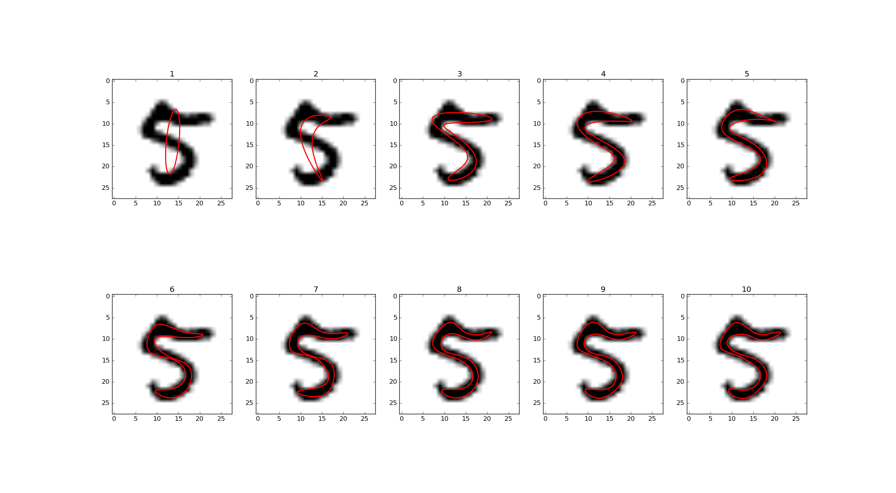

.. PyEFD documentation master file, created by
   sphinx-quickstart on Mon Apr 18 09:48:09 2016.
   You can adapt this file completely to your liking, but it should at least
   contain the root `toctree` directive.

PyEFD
=====

.. image:: https://github.com/hbldh/pyefd/workflows/Build%20and%20Test/badge.svg
    :target: https://github.com/hbldh/pyefd/actions?query=workflow%3A%22Build+and+Test%22
.. image:: http://img.shields.io/pypi/v/pyefd.svg
    :target: https://pypi.python.org/pypi/pyefd/
.. image:: http://img.shields.io/pypi/dm/pyefd.svg
    :target: https://pypi.python.org/pypi/pyefd/
.. image:: http://img.shields.io/pypi/l/pyefd.svg
    :target: https://pypi.python.org/pypi/pyefd/
.. image:: https://coveralls.io/repos/github/hbldh/pyefd/badge.svg?branch=master
    :target: https://coveralls.io/github/hbldh/pyefd?branch=master

An Python/NumPy implementation of a method for approximating a contour with a Fourier series, as described in [#first]_.

    EFD representations of an MNIST [#second]_ digit. Shows progressive improvement of approximation
    by order of Fourier series.

Installation
------------

.. code:: bash

    $ pip install pyefd

Usage
-----

Given a closed contour of a shape, generated by e.g. `scikit-image <http://scikit-image.org/>`_
or `OpenCV <http://opencv.org/>`_, this package can fit a
`Fourier series <https://en.wikipedia.org/wiki/Fourier_series>`_
approximating the shape of the contour. 

General usage examples
~~~~~~~~~~~~~~~~~~~~~~

This section describes the general usage patterns of :py:mod:`pyefd`.

.. code:: python

    from pyefd import elliptic_fourier_descriptors
    coeffs = elliptic_fourier_descriptors(contour, order=10)

The coefficients returned are the :math:`a_n`, :math:`b_n`, :math:`c_n` and :math:`d_n` of
the following Fourier series representation of the shape.

The coefficients returned can be normalized so that they are
rotation and size-invariant. This can be achieved by calling:

.. code:: python

    from pyefd import elliptic_fourier_descriptors
    coeffs = elliptic_fourier_descriptors(contour, order=10, normalize=True)

Normalization can also be done afterwards:

.. code:: python

    from pyefd import normalize_efd
    coeffs = normalize_efd(coeffs)

OpenCV example
~~~~~~~~~~~~~~

If you are using `OpenCV <http://opencv.org/>`_ to generate contours, this example
shows how to connect it to :py:mod:`pyefd`.

.. code:: python

    import cv2 
    import numpy
    from pyefd import elliptic_fourier_descriptors
    
    # Find the contours of a binary image using OpenCV.
    contours, hierarchy = cv2.findContours(
        im, cv2.RETR_TREE, cv2.CHAIN_APPROX_SIMPLE)

    # Iterate through all contours found and store each contour's 
    # elliptical Fourier descriptor's coefficients.
    coeffs = []
    for cnt in contours:
        # Find the coefficients of all contours
        coeffs.append(elliptic_fourier_descriptors(
            numpy.squeeze(cnt), order=10))

Using EFD as features
~~~~~~~~~~~~~~~~~~~~~

To use EFD as features, one can write a small wrapper function:

.. code:: python

    def efd_feature(contour):
        coeffs = elliptic_fourier_descriptors(
            contour, order=10, normalize=True)
        return coeffs.flatten()[3:]

If the coefficients are normalized, then ``coeffs[0, 0] = 1.0``,
``coeffs[0, 1] = 0.0`` and ``coeffs[0, 2] = 0.0``, so they can be disregarded when using
the elliptic Fourier descriptors as features.

See [#first]_ for more technical details.

Testing
-------

Run tests with:

.. code:: bash

    $ python setup.py test

or with `Pytest <http://pytest.org/latest/>`_:

.. code:: bash

    $ py.test tests.py

The tests includes a single image from the MNIST dataset of handwritten digits ([#second]_) as a contour to use
for testing.

References
----------

.. [#first] `Frank P Kuhl, Charles R Giardina, Elliptic Fourier features of a closed contour,
   Computer Graphics and Image Processing, Volume 18, Issue 3, 1982, Pages 236-258,
   ISSN 0146-664X, http://dx.doi.org/10.1016/0146-664X(82)90034-X. <http://www.sci.utah.edu/~gerig/CS7960-S2010/handouts/Kuhl-Giardina-CGIP1982.pdf>`_

.. [#second] `LeCun et al. (1999): The MNIST Dataset Of Handwritten Digits <http://yann.lecun.com/exdb/mnist/>`_

Changelog
=========

All notable changes to this project will be documented in this file.

The format is based on `Keep a
Changelog <https://keepachangelog.com/en/1.0.0/>`__, and this project
adheres to `Semantic
Versioning <https://semver.org/spec/v2.0.0.html>`__.

`1.4.1 <https://github.com/hbldh/pyefd/compare/v1.4.1...v1.4.0>`__ (2020-09-28)
-------------------------------------------------------------------------------

Added
~~~~~

-  Added ``CHANGELOG.md``

Changed
~~~~~~~

-  Change CI from Azure Devops to Github Actions

`1.4.0 <https://github.com/hbldh/pyefd/compare/v1.4.0...v1.3.0>`__ (2019-07-27)
-------------------------------------------------------------------------------

Changed
~~~~~~~

-  Merged PR #4: Vectorized contour reconstruction function

`1.3.0 <https://github.com/hbldh/pyefd/compare/v1.3.0...v1.2.0>`__ (2019-06-18)
-------------------------------------------------------------------------------

Changed
~~~~~~~

-  Merged PR #2: Numpy vectorized efd
-  Moved from Travis CI to Azure Pipelines
-  Replaced rst with markdown

`1.2.0 <https://github.com/hbldh/pyefd/compare/v1.2.0...v1.1.0>`__ (2018-06-14)
-------------------------------------------------------------------------------

Changed
~~~~~~~

-  Updated setup.py
-  Updated numpy requirement

Added
~~~~~

-  Added Pipfile
-  Ran Black on code
-  Testing on 3.6

`1.1.0 <https://github.com/hbldh/pyefd/compare/v1.1.0...v1.0.0>`__ (2018-06-13)
-------------------------------------------------------------------------------

Added
~~~~~

-  New example for OpenCV
-  Updated documentation

`1.0.0 <https://github.com/hbldh/pyefd/compare/v1.0.0...v0,1.2>`__ (2016-04-19)
-------------------------------------------------------------------------------

Changed
~~~~~~~

-  Deemed stable enough for version 1.0 release

Added
~~~~~

-  Created documentation.

`0.1.2 <https://github.com/hbldh/pyefd/compare/v0.1.2...v0,1.1>`__ (2016-02-29)
-------------------------------------------------------------------------------

Changed
~~~~~~~

-  Testing with pytest instead of nosetests.

Added
~~~~~

-  Added Coveralls use.

`0.1.1 <https://github.com/hbldh/pyefd/compare/v0.1.1...v0,1.0>`__ (2016-02-17)
-------------------------------------------------------------------------------

Fixed
~~~~~

-  Fixed MANIFEST

Added
~~~~~

-  Added LICENSE file that was missing.

0.1.0 (2016-02-09)
------------------

Added
~~~~~

-  Initial release

API
---

.. automodule:: pyefd
   :members:

Indices and tables
==================

* :ref:`genindex`
* :ref:`modindex`
* :ref:`search`

